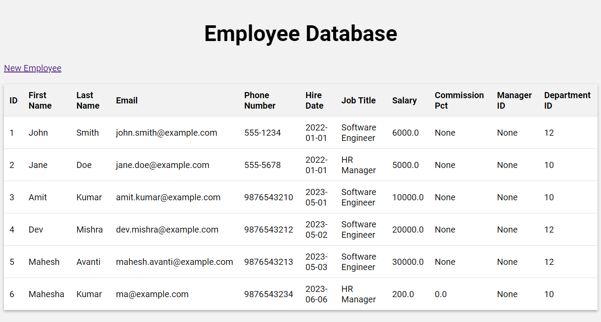
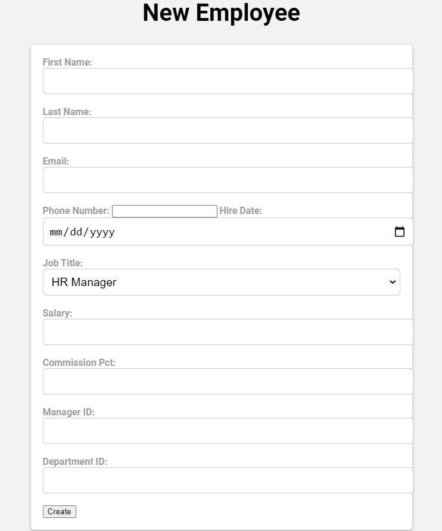
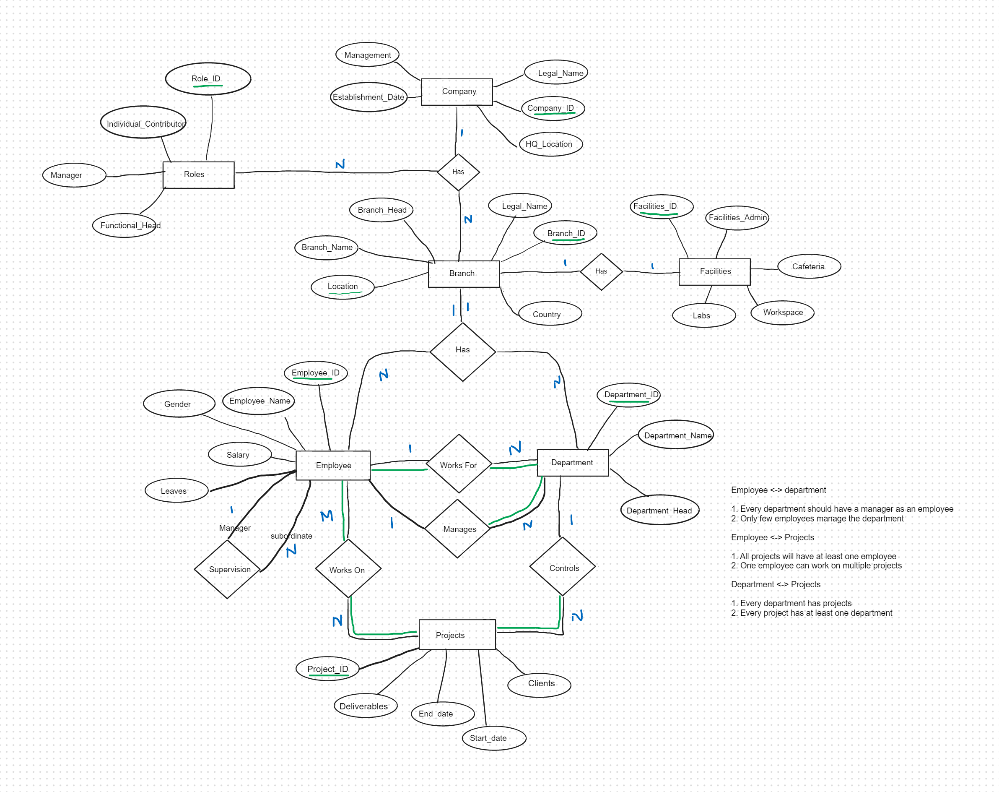

# personnel-mgmt

Personnel Management System with Branches all over the world

## Usage

Install requirements

```sh
pip install -r requirements.txt
```

Start the app

```sh
python app.py
```

If you are running the app, the first time. Then you would need to run

```sh
python populate_db.py
```

### website

See Employee table



Add new employee entry



## Database Schema


## Entity Relationship Diagram




Fig. ER Diagram


## Database Schema


